# Vue Demo Exercise Submission

This workspace contains a series of small Vue.js demo files for learning and practice.

## Screenshots

- vue_demo1.html
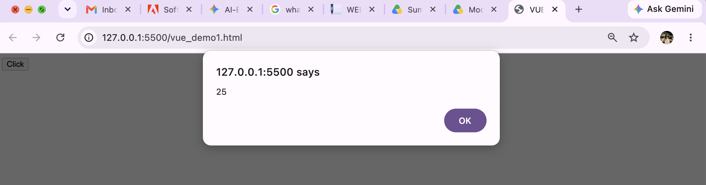

- vue_demo2.html
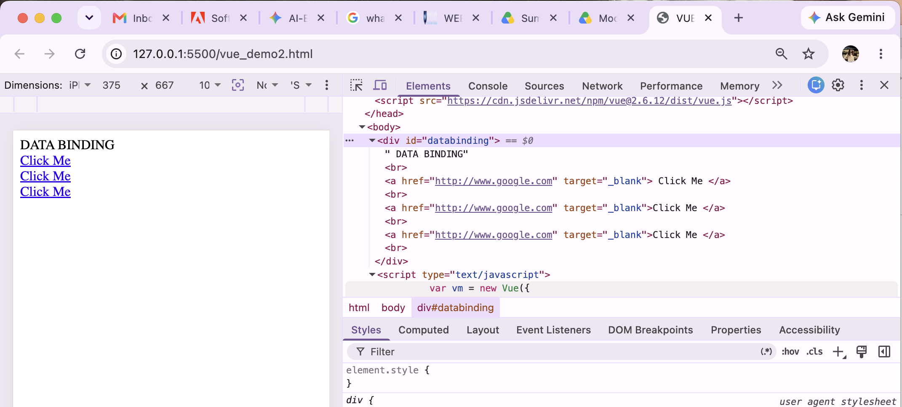

- vue_demo3.html
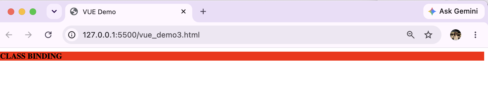

- vue_demo4.html
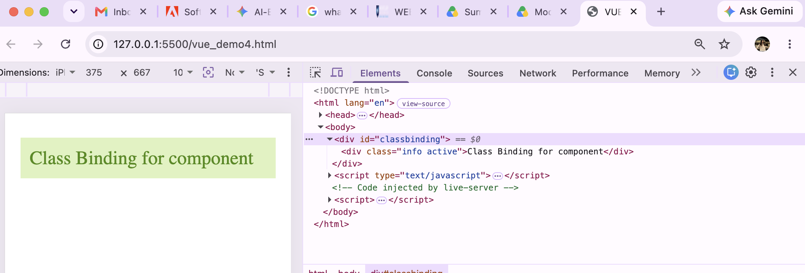

- vue_demo5.html
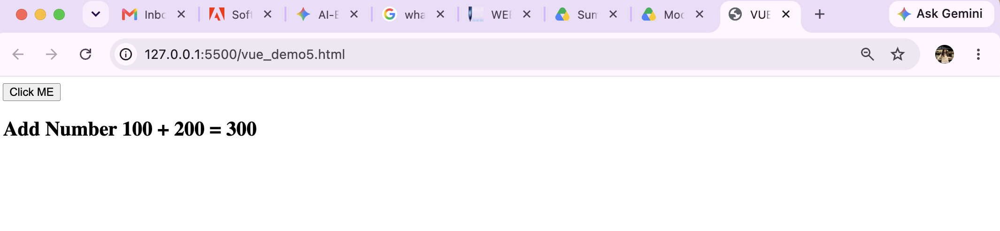

- vue_demo6.html
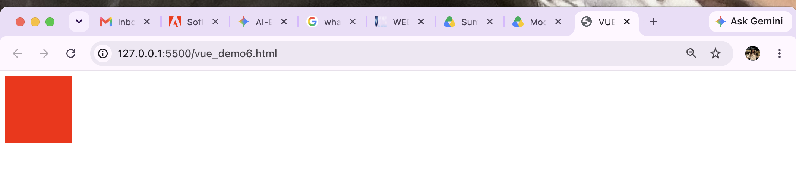
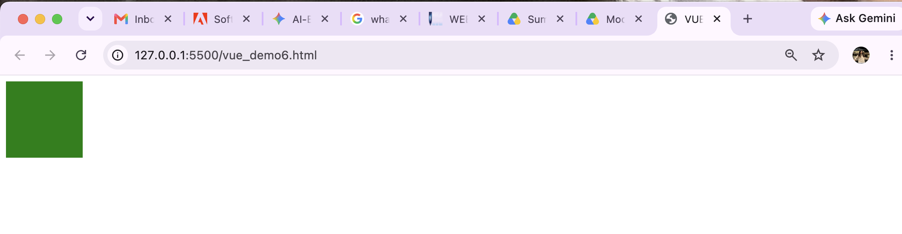

- vue_demo7.html
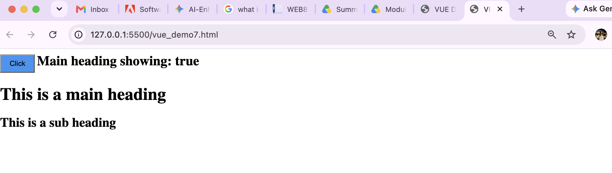
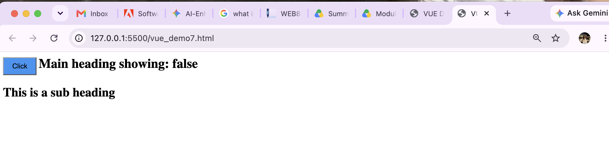

- vue_demo8.html
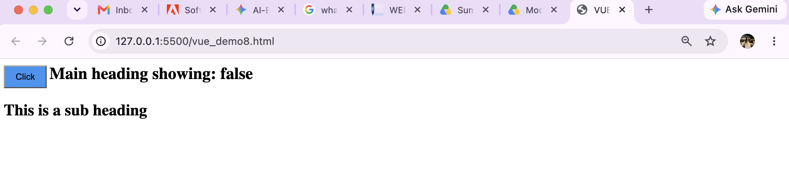

- vue_demo9.html
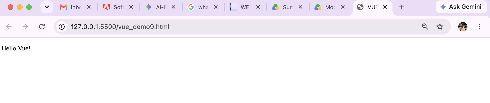

- vue_demo10.html
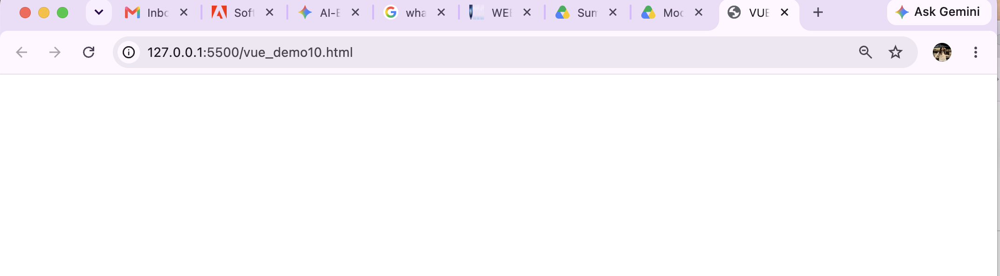

- vue_demo11.html
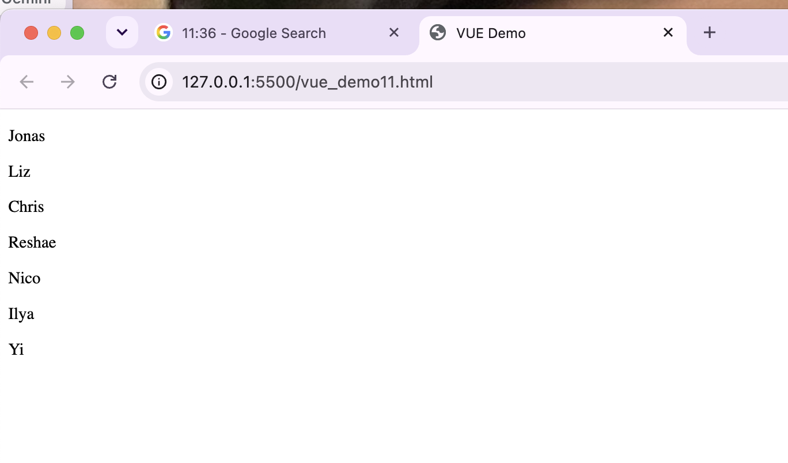

- vue_demo12.html
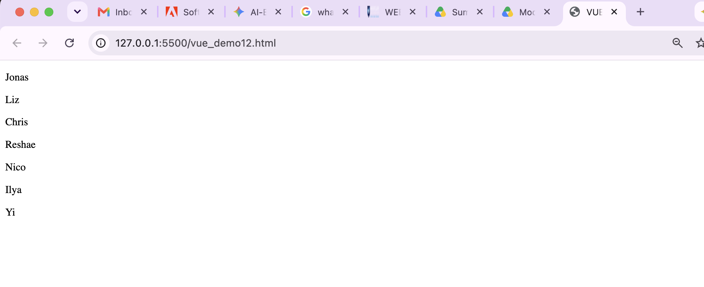

- vue_demo13.html
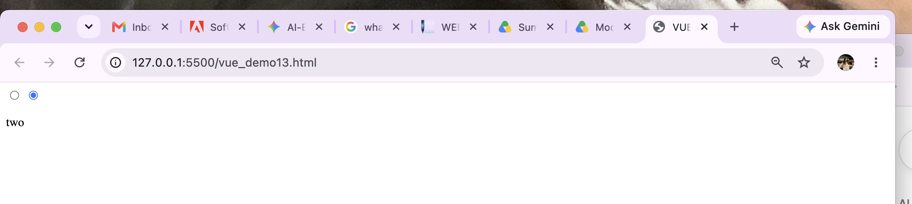

- vue_demo14.html
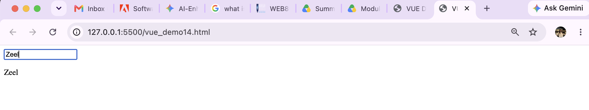

- vue_demo15.html
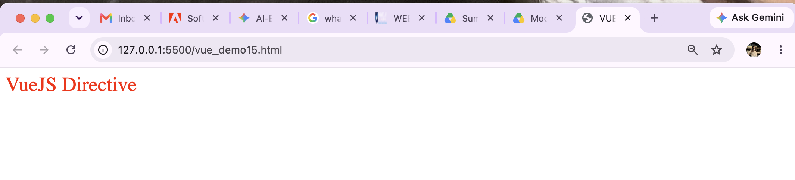

- vue_demo16.html
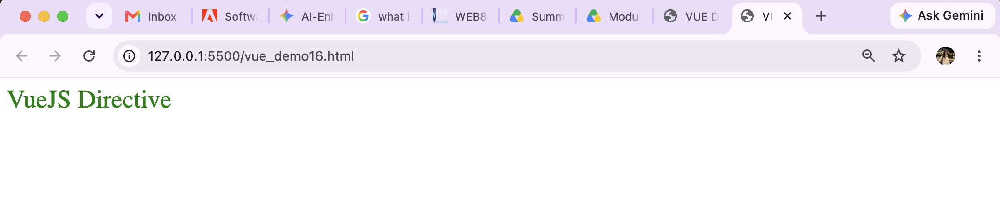

## Files

The project includes examples such as:

- `vue_demo1.html` through `vue_demo16.html`

Each file demonstrates a different Vue concept or example feature, such as:

- directives
- data binding
- event handling
- computed properties
- conditional rendering
- loops
- components
- and other beginner-to-intermediate Vue topics

## How to use

1. Open any `.html` file in a browser.
2. If the example uses a local Vue script, make sure the browser can load the Vue CDN.
3. For best results, use a local web server if needed.

Example:

```bash
python3 -m http.server 8000
```

Then open:

```text
http://localhost:8000/
```

## Notes

This is a demo exercise folder for Web 801 and is intended for practice and classroom learning.
